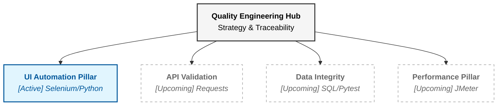

# Healthcare Claims: Quality Engineering Strategy Hub

This repository serves as the **Master Test Strategy** and orchestration center for the Healthcare Claims Management system. Instead of a single monolithic repo, our quality strategy is divided into specialized, high-performance suites for UI, API, Data, and Performance.

## The Mission
The objective is to achieve **90%+ automated regression coverage** for the Claims lifecycle. By implementing a "Shift-Left" approach, we validate business logic at the API and Database levels before the UI is even rendered, significantly reducing the cost of defects found in UAT.

## Integrated Quality Architecture (Specialized Pillars)
This hub manages four high-performance repositories that validate the full claims lifecycle.



For detailed strategy and execution on each pillar, refer to their respective hubs.

*   [UI Automation (Selenium)](https://github.com/SrinivasaraoThata/claims-ui-automation): End-to-end UX integrity.

## Technology Rationale
*   **Python Stack**: Chosen for its library support (Requests, Pytest) and ease of integration into modern CI/CD pipelines.
*   **ParaBank Proxy**: Used to simulate the "Claims" lifecycle. Financial transactions are mapped to Claim States (Pending -> Processed -> Approved).
*   **Centralized Traceability**: All tests are mapped to the **[Master RTM](docs/master-rtm.md)** found in this hub.

## Strategic Goals
*   **Reduce Manual Overhead**: Automating 15+ high-frequency manual claim checks.
*   **Feedback Loop**: Reducing the regression cycle from 3 days to 45 minutes via parallel execution.
*   **Security & Compliance**: Validating PII/PHII masking and RBAC early in the cycle (See **[Compliance Strategy](docs/compliance-security.md)**).

## Hub Structure
```text
claims-qa-suite/
├── docs/                 # Strategy, Master RTM, and Compliance documentation
│   ├── master-rtm.md     # Requirements Traceability
│   └── compliance-security.md # HIPAA/PHI Security Strategy
├── test-strategy/        # STLC phase definitions and Tooling rationale
└── README.md             # Strategy Overview
```

---
**Srinivasa Rao Thata** | Senior QA Automation Engineer
`Quality Engineering | Strategy & Orchestration`
